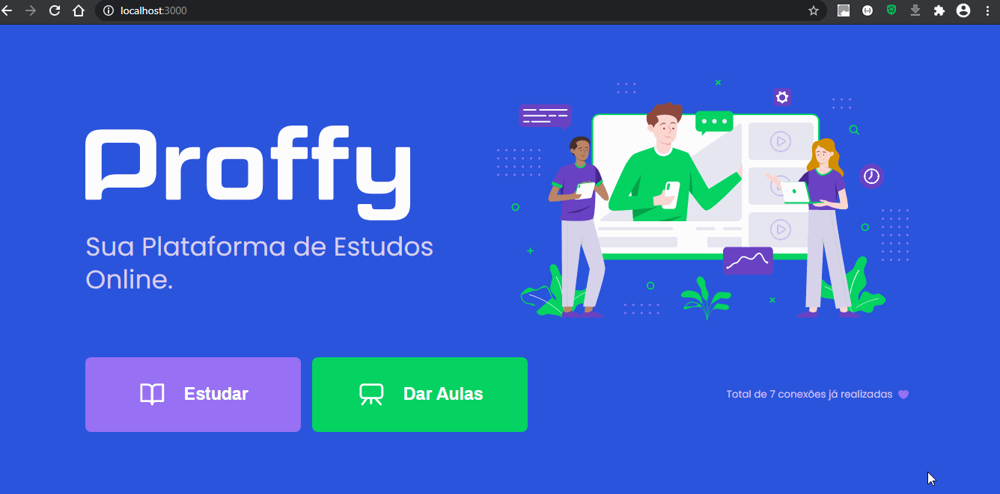

<h1 align="center">

</h1>
<h1 align="center">
    Next Level Week #2</br>
    Node.js | ReactJS | React Native | Typescript
</h1>
<hr/>
<p align="center">
  
  
   
  <br/>
  <!-- <a href="https://insomnia.rest/run/?label=nextlevelweek2&uri=https%3A%2F%2Fraw.githubusercontent.com%2FHigorSnt%2Fproffy%2Fmaster%2F.github%2FInsomnia.json" target="_blank"></a> -->
</p>

<hr/>

<h2 align="center">Proffy Web / Mobile</h2>
<h1 align="center">


</h1>

<hr/>

## About

React Native + ReactJS + NodeJS + Typescript project developed on RocketSeat NexLevelWeek #2. This project is based on an application for connect students and teachers.

## Technologies

This project was developed with the following technologies:

- API:

  - [NodeJS](https://nodejs.org/en/)
  - [Typescript](https://www.typescriptlang.org/)
  - [ts-node-dev](https://github.com/whitecolor/ts-node-dev)
  - [Express](https://expressjs.com/)
  - [KnexJS](http://knexjs.org/)
  - [SQLite3](https://www.npmjs.com/package/sqlite3)
  - [Cors](https://www.npmjs.com/package/cors)

- Web:

  - [ReactJS](https://reactjs.org/)
  - [Typescript](https://www.typescriptlang.org/)
  - [React Router v5](https://github.com/ReactTraining/react-router)
  - [Axios](https://github.com/axios/axios)
  - [styled-components](https://styled-components.com/)

- Mobile:

  - [React Native](https://reactnative.dev/)
  - [Expo](https://expo.io/)
  - [Typescript](https://www.typescriptlang.org/)
  - [React Navigation v5](https://reactnavigation.org/)
  - [styled-components](https://styled-components.com/)
  - [Axios](https://github.com/axios/axios)

<hr/>

## How To Use

To clone and run this application, you'll need Git, Node.js v14.4.0 or higher + Yarn v1.22.4 or higher installed on your computer. From your command line:

# :construction_worker: How to run

### Clone this repository

```
$ git clone https://github.com/ivanvieirace/nextlevelweek2.git
```

## 📦 Run API

```bash
# Go to Server folder
$ cd server

# Install Dependencies
$ npm install

# Run Application
$ yarn start
```

Access API at http://localhost:3333/

## 💻 Run Web Project

```bash
# Go to Web folder
$ cd web

# Install Dependencies
$ npm install

# Run Application
$ yarn start
```

Go to http://localhost:3000/ to see the result.

## 📱 Run Mobile Project

To run the mobile project you need a cellphone with the app of [expo](https://play.google.com/store/apps/details?id=host.exp.exponent) instaled or a emulator android/ios.
<br />
After, fork this repository and clone to your machine. Inside of the project's folder run the following commands:

```bash
# Go to Mobile folder
$ cd mobile

# Install Dependencies
$ npm install

# Run Application
$ yarn start
```

## License

This project is under the MIT license. See the [LICENSE](https://github.com/ivanvieirace/nextlevelweek2/blob/master/LICENSE.md) for more information.

---

## Author


Made with :blue_heart: by Ivan Vieira :wave: [Get in touch!](https://www.linkedin.com/in/ivanvieira/)

[](https://www.linkedin.com/in/ivanvieira/)
[](mailto:ivanjr.ce@gmail.com)
